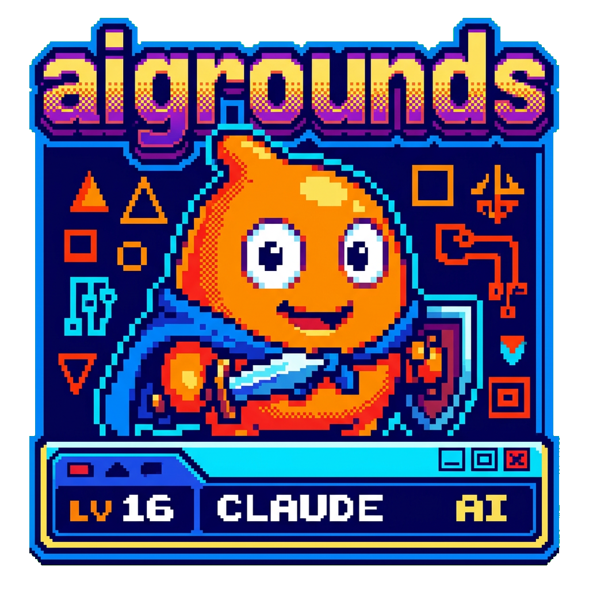

<div align="center">
  

  [](https://nextjs.org/)
  [](https://react.dev/)
  [](https://www.typescriptlang.org/)
  [](https://tailwindcss.com/)

  **🧠 Learn AI ideas by poking the algorithm until it explains itself 🔬**

</div>

## Overview

**The Pain:** AI algorithms are explained with math-heavy papers and static diagrams. You read about UCT formulas and backpropagation but never *feel* how they work.

**The Solution:** AI Grounds is a collection of interactive playgrounds where you run algorithms step-by-step, watch trees grow, and see scores update live — all in your browser.

**The Result:** Concepts that took hours to grok from textbooks click in under 10 minutes of hands-on exploration.

## ⚡ Features

- **Interactive simulations** — run algorithms one step at a time or let them play out automatically
- **Live narration** — each phase is explained as it happens (Selection → Expansion → Simulation → Backpropagation)
- **Visual tree rendering** — watch the search tree grow with opacity, color, and path highlighting
- **Adjustable parameters** — tweak exploration constants and see the effect immediately
- **Modular architecture** — each AI concept is a self-contained playground, easy to extend
- **Zero backend** — everything runs client-side, no API keys or servers needed

## 🧪 Available Playgrounds

### Monte Carlo Tree Search

Watch exploration and exploitation negotiate in public. A starship crew explores unknown regions while the MCTS algorithm learns which paths yield the best rewards.

| What you'll learn | Time |
|---|---|
| How UCT balances popular vs. uncertain branches | 8-12 min |
| What expansion, rollout, and backpropagation each contribute | |
| Why the best move emerges only after repeated simulations | |

**Concepts covered:** Selection, UCT, Rollouts, Backpropagation

## 🗺️ Upcoming Modules

| Module | Description |
|--------|-------------|
| **Attention Maps** | Trace how tokens compete for influence and why context can suddenly dominate a generation |
| **Q-Learning Arcade** | Watch value estimates form over repeated trials and see the effect of exploration schedules |
| **Diffusion Studio** | Scrub through denoising steps to understand why images sharpen gradually |

## 🚀 Quick Start

```bash
# Clone the repository
git clone https://github.com/tsilva/aigrounds.git
cd aigrounds

# Install dependencies
npm install

# Start the development server
npm run dev
```

Open [http://localhost:3000](http://localhost:3000) and jump into the MCTS lab.

## 🏗️ Project Structure

```
src/
├── app/                        # Next.js App Router
│   ├── page.tsx                # Homepage with playground catalog
│   └── playgrounds/[slug]/    # Dynamic playground routes
├── components/
│   └── playground-shell.tsx    # Shared shell for all modules
├── lib/
│   └── playgrounds.ts         # Playground registry & metadata
└── modules/
    └── mcts/                   # Monte Carlo Tree Search
        ├── MctsPlayground.tsx  # Interactive visualization
        ├── mcts-engine.ts     # Core algorithm implementation
        └── scenario.ts        # Mission tree & game state
```

Each module lives in its own folder under `modules/` with its component, engine, and data — making new playgrounds easy to add without touching existing code.

## 🛠️ Tech Stack

| Layer | Technology |
|-------|-----------|
| Framework | Next.js 16 (App Router, static generation) |
| UI | React 19 + TypeScript 5 |
| Styling | Tailwind CSS 4 |
| Fonts | Space Grotesk + IBM Plex Mono |
| Deployment | Vercel (static + client-side) |

## 🤝 Contributing

Want to add a new AI playground? Each module follows a simple pattern:

1. Create a folder under `src/modules/` with your component, engine, and data
2. Register it in `src/lib/playgrounds.ts`
3. The routing and shell are handled automatically

## ⭐ Star Us

If this helped you understand an AI concept, [give us a star](https://github.com/tsilva/aigrounds) — it helps others find these playgrounds too.

## License

MIT
