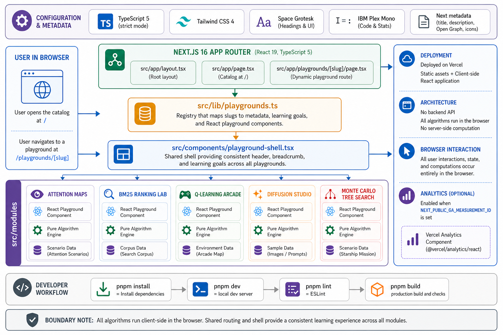

<div align="center">
  

  **🧠 Learn AI ideas by poking the algorithm until it explains itself 🔬**

  [Live Demo](https://aigrounds.tsilva.eu)
</div>

AI Grounds is an interactive educational web app for learning AI concepts through hands-on playgrounds. Instead of reading static explanations, you run small visual simulations and watch the important tradeoffs change in the browser.

The app currently includes labs for Attention Maps, BM25 ranking, Q-learning, Diffusion Studio, and Monte Carlo Tree Search.

## Install

```bash
git clone https://github.com/tsilva/aigrounds.git
cd aigrounds
pnpm install
pnpm dev
```

Open [http://localhost:3000](http://localhost:3000).

## Commands

```bash
pnpm dev      # start the local dev server
pnpm build    # create a production build
pnpm start    # serve the production build locally
pnpm lint     # run ESLint
```

## Notes

- The repo enforces pnpm in `package.json`; run `corepack enable` first if pnpm is not available.
- All playgrounds run client-side. There is no server API and no required database.
- Google Analytics loads only when `NEXT_PUBLIC_GA_MEASUREMENT_ID` is set.
- Vercel Analytics is wired through `@vercel/analytics/next`.
- New playgrounds are registered in `src/lib/playgrounds.ts` and rendered through the dynamic playground route.
- No test framework is configured yet.

## Architecture



## License

[MIT](LICENSE)
