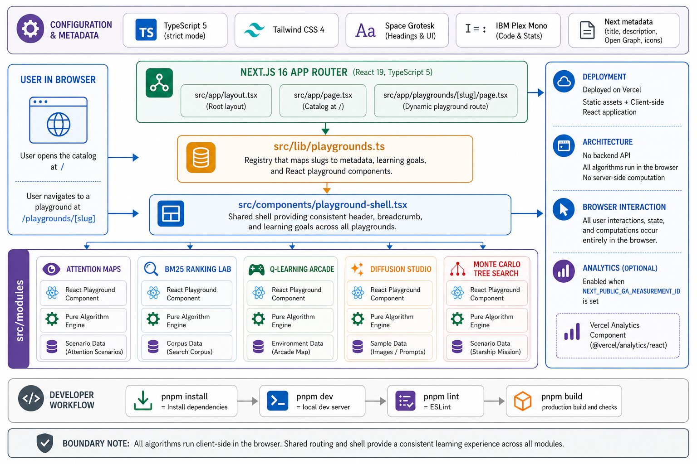

<div align="center">
  

  **🧠 Learn AI ideas by poking the algorithm until it explains itself 🔬**

  [Live Demo](https://aigrounds.tsilva.eu)
</div>

AI Grounds is an interactive educational web app for learning AI concepts through hands-on playgrounds. Instead of reading static explanations, you run small visual simulations and watch the important tradeoffs change in the browser.

The app currently includes labs for Mean, Median & Mode, Range, Quartiles & IQR, Variance & Standard Deviation, Shape, Skew & Outliers, Probability Rules, Conditional Probability & Independence, Bayes Rule, Expected Value & Risk, Bernoulli/Categorical/Binomial distributions, Waiting & Arrival Distributions, Overfitting, Confusion Matrix & Thresholds, Softmax Temperature, Cross Entropy Loss, KL Divergence, Matrix Multiplication, Gradient Descent, Monte Carlo Tree Search, Byte Pair Encoding, Transformer Attention, Batch Normalization, Layer Normalization, MNIST MLP Inference Debugging with WebGPU, PyTorch Image Augmentations, Label-Mixing Image Transforms, Autograd Graphs, Backpropagation Inspector, Linear Quantization (INT4), and Zero Knowledge Proofs.

## Install

```bash
git clone https://github.com/tsilva/aigrounds.git
cd aigrounds
pnpm install
pnpm dev
```

Open [http://localhost:3000](http://localhost:3000).

## Commands

```bash
pnpm dev      # start the local dev server
pnpm build    # create a production build
pnpm start    # serve the production build locally
pnpm lint     # run ESLint
pnpm check:cycles # verify local imports are acyclic
```

## Environment

Playground chat uses OpenRouter from a server route. Configure:

```bash
OPENROUTER_API_KEY=...
OPENROUTER_MODEL=openai/gpt-5.5
OPENROUTER_SITE_URL=https://aigrounds.tsilva.eu
OPENROUTER_APP_NAME=AI Grounds
```

Sentry error monitoring is wired through `@sentry/nextjs`. Configure the runtime DSN and source map upload token:

```bash
SENTRY_DSN=...
NEXT_PUBLIC_SENTRY_DSN=...
SENTRY_ORG=tsilva
SENTRY_PROJECT=aigrounds
SENTRY_AUTH_TOKEN=...
```

Use the same Sentry project DSN for `SENTRY_DSN` and `NEXT_PUBLIC_SENTRY_DSN`. Set `SENTRY_DSN` for server and edge errors, `NEXT_PUBLIC_SENTRY_DSN` for browser errors, and `SENTRY_AUTH_TOKEN` only in local/CI/Vercel build environments so production source maps can be uploaded. Do not commit real values.

## Notes

- The repo enforces pnpm in `package.json`; run `corepack enable` first if pnpm is not available.
- Playgrounds run client-side. The chat sidebar uses a server API route to keep the OpenRouter key out of the browser.
- Google Analytics loads only when `NEXT_PUBLIC_GA_MEASUREMENT_ID` is set.
- Vercel Analytics is wired through `@vercel/analytics/next`.
- Sentry initializes only when its DSN environment variables are present.
- The home dashboard is the canonical current and future lesson plan. Live lessons are registered in `activePlaygroundMetadata`, future lesson cards live in `upcomingPlaygrounds`, and `dashboardLessonPlanOrder` controls the combined dashboard order.
- New live playgrounds are registered in `src/lib/playground-metadata.ts`, wired to components in `src/lib/playgrounds.ts`, and rendered through the dynamic playground route. Sitemap entries are generated from the active playground metadata.
- No test framework is configured yet.

## Architecture



## License

[MIT](LICENSE)
